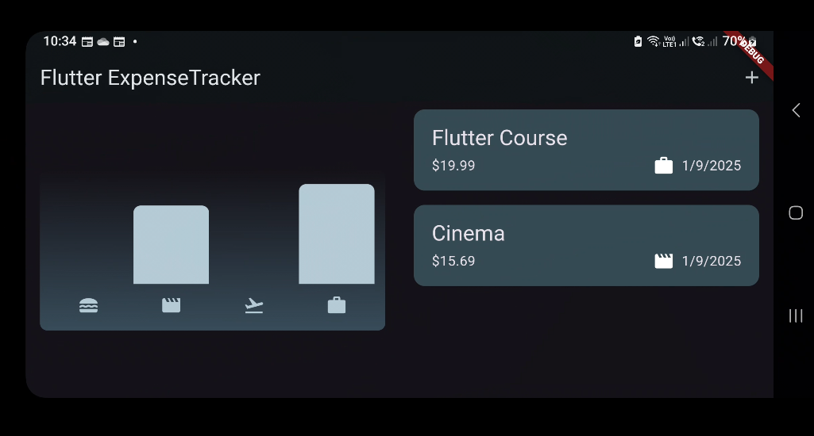
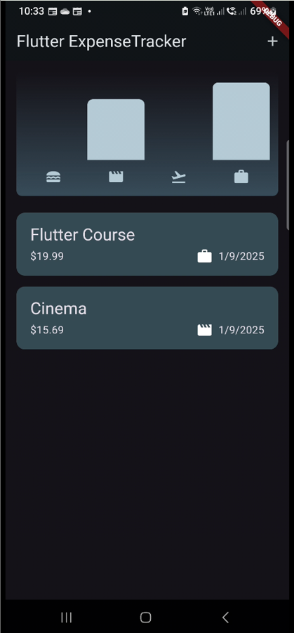

# The Responsive Expense Tracker App
 

## About
The same as the [Expense Tracker App](https://github.com/NathanTh3Gr3at/expense_tracker) but changes were made to ensure that the app interface doesnot look messy if the phone is horizontal.

## Features:
  - Tracks Expenses
  - Provides a graph

## Packages Used:
  - Intl
  - Uuid

## Images
<table>
  <tr>
    <th>Screen Name</th>
    <th>Screenshot</th>
  </tr>
  <tr>
    <td><strong>Landscape</strong></td>
    <td></td>
  </tr>
  <tr>
    <td><strong>Portrait</strong></td>
    <td></td>
  </tr>
</table>

